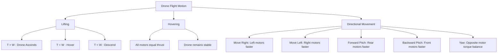

# Aerial Terms used in Drones

## **Drone Flight Physics and Motion Control**

### **How to Lift an Object**

To lift a drone from the ground, the **thrust ($T$)** produced by its propellers must overcome the **weight ($W$)** caused by gravity.

When:

* $T > W \implies$ The drone ascends
* $T = W \implies$ The drone hovers
* $T < W \implies$ The drone descends

The relationship between force, mass, and acceleration is given by
$$F = m \times a$$

For hovering condition:
$$T = m \times g$$
where $g = 9.81 , m/s^2$

Thus, to lift the drone, $T$ must exceed $m \times g$.

---

### **Linear Motion**

Linear motion occurs when the drone moves in a straight line — forward, backward, left, or right.
This happens by changing thrust distribution among the motors.

Net linear force:
$$F_{\text{net}} = m \times a$$

---

### **Rotational Motion**

Rotational motion occurs when the drone rotates around its **principal axes**:

* Roll (x-axis)
* Pitch (y-axis)
* Yaw (z-axis)

Each motor produces a **reactive torque ($\tau$)** opposite to its rotation.
To prevent spinning, two motors rotate **clockwise (CW)** and two **counterclockwise (CCW)**, ensuring torque balance:
$$\sum \tau_{\text{CW}} = \sum \tau_{\text{CCW}}$$

---

### **Performing Different Tasks with a Drone**

The drone performs maneuvers by adjusting motor speeds, thus varying thrust.

#### **1. Hovering**

All motors produce equal thrust:
$$T_1 = T_2 = T_3 = T_4 = \dfrac{W}{4}$$
Result: The drone maintains altitude.

---

#### **2. Moving Right**

* Increase speed of left motors (3, 4)
* Decrease speed of right motors (1, 2)
  $\implies$ Drone tilts right and moves rightward.

#### **3. Moving Left**

* Increase speed of right motors (1, 2)
* Decrease speed of left motors (3, 4)
  $\implies$ Drone tilts left and moves leftward.

#### **4. Moving Forward (Forward Pitch)**

* Increase speed of rear motors (1, 3)
* Decrease speed of front motors (2, 4)
  $\implies$ Nose tilts downward, drone moves forward.

#### **5. Moving Backward (Backward Pitch)**

* Increase speed of front motors (2, 4)
* Decrease speed of rear motors (1, 3)
  $\implies$ Nose tilts upward, drone moves backward.

---

### **Forward and Backward Pitch**

| Motion         | Action              | Motor Speed Adjustment | Effect               |
| -------------- | ------------------- | ---------------------- | -------------------- |
| Forward Pitch  | Nose tilts downward | Rear motors ↑          | Drone moves forward  |
| Backward Pitch | Nose tilts upward   | Front motors ↑         | Drone moves backward |

Pitch changes the drone’s inclination along the **lateral (side-to-side) axis**, controlling forward/backward movement.

---

### **Right and Left Roll**

| Motion     | Action            | Motor Speed Adjustment | Effect            |
| ---------- | ----------------- | ---------------------- | ----------------- |
| Right Roll | Drone tilts right | Left motors ↑          | Drone moves right |
| Left Roll  | Drone tilts left  | Right motors ↑         | Drone moves left  |

Roll changes the drone’s inclination along the **longitudinal (front-to-back) axis**, causing sideways movement.

---

### **Roll, Pitch, and Yaw: Definitions and Effects**

| Motion           | Axis                  | Definition                             | Effect                        |
| ---------------- | --------------------- | -------------------------------------- | ----------------------------- |
| Roll ($\phi$)    | Longitudinal (X-axis) | Tilting left or right                  | Moves sideways                |
| Pitch ($\theta$) | Lateral (Y-axis)      | Tilting forward or backward            | Moves forward/backward        |
| Yaw ($\psi$)     | Vertical (Z-axis)     | Rotating clockwise or counterclockwise | Changes direction/orientation |

---

### **Formula for Thrust**

The thrust produced by a propeller depends on air density, rotational speed, and propeller dimensions.

$$T = C_T , \rho , n^2 , D^4$$

where:

* $T$ = Thrust (N)
* $C_T$ = Thrust coefficient
* $\rho$ = Air density (kg/m³)
* $n$ = Propeller rotational speed (revolutions per second)
* $D$ = Propeller diameter (m)

Empirical observations from the PDF:

* Increasing pitch from 4.5″ to 5″ increases thrust by about 8.3%
* Increasing diameter by 1″ increases thrust by about 16%

---

### **Mermaid Diagram – Drone Motion and Control**

# References

###### Information
- date: 2025.10.06
- time: 00:40