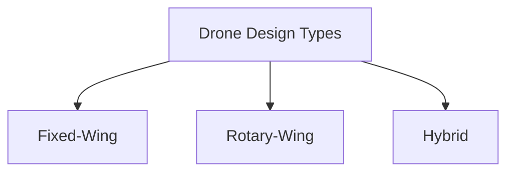
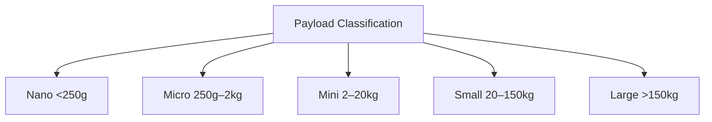
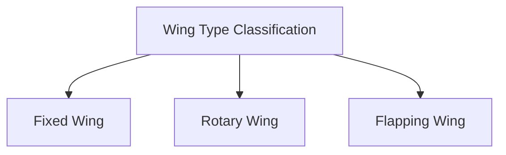
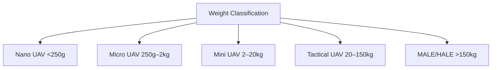
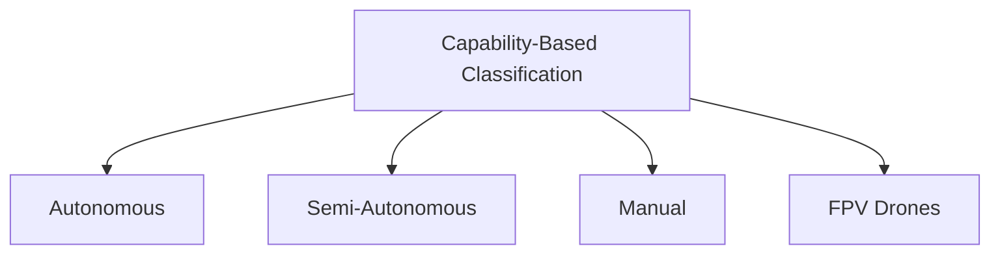

# Drone 

### **Definition of Drone**

A **Drone**, also known as an **Unmanned Aerial Vehicle (UAV)**, is an aircraft that operates **without a human pilot onboard**.
It is controlled either **remotely** by an operator or **autonomously** using pre-programmed flight plans and **onboard sensors**.

They vary in **size**, **shape**, and **application**—ranging from small consumer drones to large military UAVs.

---

### **Key Components of a Drone**

1. **Frame (X-Frame)** – Structural skeleton holding all components.
2. **Propellers** – Generate lift by creating air pressure difference.
3. **Motors (BLDC)** – Convert electrical energy to mechanical rotation.
4. **Electronic Speed Controllers (ESCs)** – Regulate motor speed using PWM signals.
5. **Power Distribution Board (PDB)** – Distributes power from battery to ESCs and electronics.
6. **Flight Controller (FC)** – Central unit processing sensor data and control signals for stability.
7. **Battery (LiPo)** – Main power source.
8. **Transmitter and Receiver** – Enable wireless communication and control.
9. **Sensors (IMU, GPS, Barometer)** – Support autonomous navigation and stabilization.
10. **Landing Gear** – Absorbs shock during takeoff and landing.

---

### **Classification of Drones**

#### **1. Based on Design**

* **Fixed-Wing Drones** – Similar to airplanes, efficient for long-range flight.
* **Rotary-Wing Drones** – Include quadcopters, hexacopters, and octocopters; capable of vertical takeoff and hovering.
* **Hybrid Drones** – Combine fixed and rotary wings for efficiency and maneuverability.

---

#### **2. Based on Endurance & Range**

| Category         | Flight Time | Typical Range | Example Use             |
| ---------------- | ----------- | ------------- | ----------------------- |
| Very Short Range | < 30 min    | < 5 km        | Consumer drones         |
| Short Range      | 30–90 min   | 5–50 km       | Surveillance            |
| Medium Range     | 2–6 hr      | 50–200 km     | Mapping                 |
| Long Range       | 6–24 hr     | 200–1000 km   | Military reconnaissance |
| Endurance/HALE   | > 24 hr     | > 1000 km     | Strategic surveillance  |

---

#### **3. Based on Payload Capacity**

| Category | Payload      | Example Application            |
| -------- | ------------ | ------------------------------ |
| Nano     | < 250 g      | Hobby drones                   |
| Micro    | 250 g – 2 kg | Inspection                     |
| Mini     | 2–20 kg      | Agricultural or filming drones |
| Small    | 20–150 kg    | Cargo transport                |
| Large    | >150 kg      | Military or industrial drones  |

---

#### **4. Based on Wing Type**

| Type          | Description                                      |
| ------------- | ------------------------------------------------ |
| Fixed Wing    | Single rigid wing; efficient for long distances. |
| Rotary Wing   | Multiple propellers; stable hover and control.   |
| Flapping Wing | Mimic bird/insect flight; used in research.      |

---

#### **5. Based on Weight**

| Category     | Weight       | Example                 |
| ------------ | ------------ | ----------------------- |
| Nano UAV     | < 250 g      | Toy drones              |
| Micro UAV    | 250 g – 2 kg | FPV drones              |
| Mini UAV     | 2–20 kg      | Mapping drones          |
| Tactical UAV | 20–150 kg    | Military observation    |
| MALE / HALE  | >150 kg      | Long-endurance aircraft |

---

#### **6. Based on Capabilities**

* **Autonomous Drones** – Navigate without human control using AI and sensors.
* **Semi-Autonomous Drones** – Require partial operator control.
* **Manual Drones** – Fully pilot-controlled via radio transmitter.
* **FPV (First Person View) Drones** – Stream real-time video to operator for precision control.

---

### **Mermaid Diagrams**

#### **1. Drone Classification by Design**



#### **2. Drone Classification by Endurance**

```mermaid
graph TD
A[Endurance/Range Classification] --> B[Very Short Range]
A --> C[Short Range]
A --> D[Medium Range]
A --> E[Long Range]
A --> F[High Altitude Long Endurance (HALE)]
```

#### **3. Drone Classification by Payload**



#### **4. Drone Classification by Wing Type**



#### **5. Drone Classification by Weight**



#### **6. Drone Classification by Capabilities**




# References


###### Information
- date: 2025.10.06
- time: 00:28