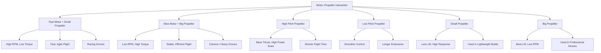
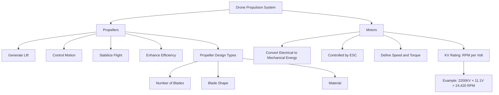

# Propellors & Motors
## **Drone Propellers and Motors**

### **Propellers**

Propellers are **aerodynamic blades** that convert the motor’s rotation into **linear thrust** by accelerating air downward, producing an upward reactive force according to Newton’s third law.

When the propellers spin:
$$T > W \implies \text{Drone Ascends}$$
$$T = W \implies \text{Drone Hovers}$$
$$T < W \implies \text{Drone Descends}$$

Here, $T$ is thrust and $W = m \times g$ is the drone’s weight.

---

### **Properties Affecting Propeller Performance**

**Diameter ($D$)**
Larger diameter propellers displace more air, generating greater thrust but reducing RPM and efficiency due to higher drag.
Smaller diameters spin faster with less drag, providing agility but lower lift.

**Pitch ($P$)**
Pitch is the theoretical distance the propeller would travel in one full rotation.

* High pitch → greater thrust and higher speed, but increased current draw and reduced flight time.
* Low pitch → smoother flight, less thrust, more endurance.

**Blade Count**

* 2-blade: light and efficient (used in racing).
* 3-blade: balanced thrust and stability.
* 4+ blades: high lift, but reduced efficiency.

**Material**

* Plastic: lightweight and flexible, suitable for beginners.
* Carbon fiber: strong and rigid, ideal for professional drones.
* Wood: uncommon, used in custom designs for specific aerodynamics.

---

### **Propeller Types**

| Type                   | Description                | Application                        |
| ---------------------- | -------------------------- | ---------------------------------- |
| Clockwise (CW)         | Rotates rightward (pusher) | Paired with CCW for torque balance |
| Counterclockwise (CCW) | Rotates leftward (puller)  | Paired with CW propellers          |
| Foldable               | Blades fold inward         | Portable and travel drones         |
| Fixed                  | Rigid non-folding          | Racing and industrial drones       |

---

### **Motors**

Motors convert **electrical energy into rotational motion**, driving the propellers to produce thrust.
Modern drones use **Brushless DC (BLDC)** motors due to their efficiency, high torque-to-weight ratio, and long lifespan.

---

### **Motor Parameters**

**Current ($I$)**
Determines how much power the motor draws; excessive current causes heating.

**Voltage ($V$)**
Should match the LiPo battery rating (e.g., 3S = 11.1V, 4S = 14.8V).

**Torque ($\tau$)**
Determines how large a propeller the motor can efficiently spin.
High torque motors handle larger propellers; low torque motors are better suited for smaller, high-speed propellers.

---

### **Motor Types**

| Type                   | Description                                        | Use                         |
| ---------------------- | -------------------------------------------------- | --------------------------- |
| Brushed Motor          | Simple design using brushes; low efficiency        | Toy or training drones      |
| Brushless Motor (BLDC) | Uses electronic commutation; efficient and durable | Standard in modern drones   |
| Outrunner Motor        | Outer shell rotates; high torque output            | Multirotors and FPV drones  |
| Inrunner Motor         | Rotor spins inside; high speed, low torque         | Fixed-wing or racing drones |

---

### **Motor and Propeller Relationship**

The **combination of motor speed and propeller characteristics** determines a drone’s lift, agility, and efficiency.

#### **Fast Motor with Small Propeller**

* High rotational speed (RPM)
* Low torque
* Quick response and agility
* Used in **racing drones** for speed and maneuverability

#### **Slow Motor with Big Propeller**

* Lower RPM, higher torque
* Greater lift and efficiency
* Used in **camera or heavy-lift drones** for stable flight

#### **Motor with High-Pitch Propeller**

* Produces greater thrust and faster forward motion
* Consumes more power, shorter flight time
* Suitable for **racing and high-speed applications**

#### **Motor with Low-Pitch Propeller**

* Provides smoother control, better efficiency
* Suitable for **cinematography and endurance flights**

#### **Motor with Small Propeller**

* Spins faster, generates less lift
* Ideal for **lightweight and agile drones**

#### **Motor with Big Propeller**

* Spins slower, generates high lift and stability
* Ideal for **aerial photography or payload drones**

---

### **Thrust Equation**

Thrust depends on propeller size, air density, and rotational speed:

$$T = C_T , \rho , n^2 , D^4$$

where
$T$ = thrust (N)
$C_T$ = thrust coefficient
$\rho$ = air density (kg/m³)
$n$ = propeller revolutions per second
$D$ = propeller diameter (m)

Thus, increasing either diameter ($D$) or speed ($n$) increases thrust significantly.

---

### **Mermaid Diagram – Motor and Propeller Interactions**

## **Drone Propellers and Motors**

---

### **Propellers**

Propellers are the **aerodynamic blades** responsible for converting rotational motion from the motors into **linear thrust**.
By spinning, they accelerate air downward, producing an upward reaction force that lifts and maneuvers the drone.

---

### **Functions of Propellers**

#### **1. Generating Lift**

Propellers create lift by generating a **pressure difference** between the upper and lower surfaces of the blades.
As they spin, the air pressure above the propeller decreases while pressure below increases, resulting in an upward thrust force that counteracts gravity.

$$T = C_T , \rho , n^2 , D^4$$
where
$T$ = Thrust (N),
$C_T$ = Thrust coefficient,
$\rho$ = Air density (kg/m³),
$n$ = Propeller speed (rev/s),
$D$ = Diameter (m)

When $T > W$, the drone ascends.

---

#### **2. Controlling Motion**

By varying the speed (RPM) of individual motors and propellers, drones can:

* **Pitch** (move forward/backward)
* **Roll** (move left/right)
* **Yaw** (rotate around the vertical axis)

This differential thrust gives precise control over motion in 3D space.

---

#### **3. Stabilizing Flight**

Paired **CW (clockwise)** and **CCW (counterclockwise)** propellers cancel out rotational torque:

$$\sum \tau_{\text{CW}} = \sum \tau_{\text{CCW}}$$

This keeps the drone stable and prevents unwanted spinning.

---

#### **4. Enhancing Efficiency**

Well-balanced, aerodynamically optimized propellers:

* Reduce drag and vibration.
* Improve thrust-to-power ratio.
* Extend flight time and battery life.

Lighter materials (e.g., carbon fiber) and efficient blade profiles improve overall energy efficiency.

---

### **Propeller Types Based on Design**

#### **(a) Based on Number of Blades**

| Type                    | Description          | Characteristics                         | Applications                   |
| ----------------------- | -------------------- | --------------------------------------- | ------------------------------ |
| **Two-Blade**           | Simple and efficient | Less drag, high speed, long flight time | Racing drones, fixed-wing UAVs |
| **Three-Blade**         | Balanced performance | Better stability, moderate drag         | FPV and general-purpose drones |
| **Four or More Blades** | High lift, high drag | Smooth and stable, reduced efficiency   | Cinematic or payload drones    |

---

#### **(b) Based on Blade Shape**

| Type              | Description                     | Effect                                | Application                  |
| ----------------- | ------------------------------- | ------------------------------------- | ---------------------------- |
| **Straight Edge** | Flat linear edges               | Faster response, less air resistance  | Racing and agile drones      |
| **Curved Edge**   | Curved tip for smoother airflow | Greater lift, efficiency at low speed | Photography or survey drones |
| **Foldable**      | Hinged, collapsible blades      | Portable and damage-resistant         | Travel and consumer drones   |

---

#### **(c) Based on Material**

| Material         | Characteristics   | Advantages                      | Limitations                     |
| ---------------- | ----------------- | ------------------------------- | ------------------------------- |
| **Plastic**      | Light, flexible   | Cheap, easy to replace          | Deforms easily, less efficient  |
| **Carbon Fiber** | Strong, rigid     | High efficiency, less vibration | Expensive, brittle under impact |
| **Wood**         | Balanced rigidity | Smooth operation                | Rare, less durable              |

---

### **Motors**

Motors convert **electrical energy** from the drone’s battery into **mechanical rotational energy** that drives the propellers.

Modern drones primarily use **Brushless DC (BLDC) motors** for their high efficiency, durability, and precise control.

---

### **Motor Function**

1. **Rotation Generation** – Converts input current into mechanical rotation using magnetic induction.
2. **Torque Control** – Determines how much force the motor can apply to spin propellers.
3. **Speed Control** – Achieved via the **Electronic Speed Controller (ESC)**, which varies current and voltage.

---

### **KV Rating of Motors**

The **KV rating** represents how fast the motor spins per volt applied (RPM per volt).

$$ \text{Motor Speed (RPM)} = KV \times V $$

where

* $KV$ = Motor velocity constant (RPM/V)
* $V$ = Voltage of the power source (Volts)

**Example:**
A **2200 KV** motor powered by an **11.1V (3S LiPo)** battery will rotate at:
$$ 2200 \times 11.1 = 24{,}420 , \text{RPM} $$

---

### **Interpretation of KV Rating**

| KV Value                      | Speed | Torque | Propeller Size | Typical Use                            |
| ----------------------------- | ----- | ------ | -------------- | -------------------------------------- |
| **High KV (e.g., 2000–3000)** | High  | Low    | Small          | Racing / FPV drones                    |
| **Low KV (e.g., 700–1000)**   | Low   | High   | Large          | Aerial photography / Heavy-lift drones |

* **High KV motors** spin faster but produce less torque, suitable for **small propellers**.
* **Low KV motors** spin slower but provide more torque, ideal for **larger propellers**.

---

### **Additional Notes from Reference**

* A BLDC motor of rating **2200KV** on a **3S (11.1V)** LiPo achieves **24,420 RPM**.
* Increasing **propeller diameter or pitch** increases thrust but draws more current.
* ESCs must be rated **10–20% higher** than the motor’s maximum current draw to prevent overheating.
* **Torque and RPM** are inversely related — increasing torque reduces rotational speed.

---

### **Mermaid Diagram – Propeller and Motor Overview**

---

**Summary:**
Propellers are responsible for generating lift, maintaining stability, and providing control, while motors define how efficiently and quickly that thrust is produced.
The correct pairing of **motor KV rating**, **propeller size**, and **pitch** determines the drone’s performance, efficiency, and maneuverability.

# References

###### Information
- date: 2025.10.06
- time: 00:49for