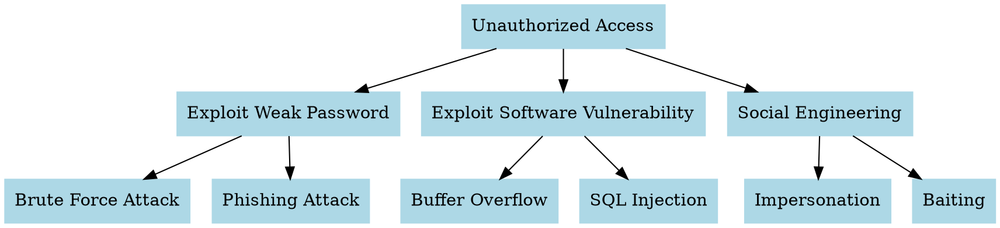

# Lab Title

**Denial of Service (SYN Flood) Simulation & Attack Tree Analysis**

---

## Goal

1. To simulate a TCP SYN Flood Denial of Service (DoS) attack and observe its impact.
2. To identify attack surfaces in a network and represent them using an attack tree.

---

## Tools

* Two machines/VMs (Attacker and Victim)
* A virtual network between these two machines
* **hping3** (for SYN flood attack)
* **Wireshark** or `netstat` (for monitoring traffic)
* **Graphviz** (for attack tree visualization)
* Basic networking commands: `ping`, `tracert`, `netstat`, `nslookup`

---

## Path of Action

### Step 1: Execute Basic Commands

* **Ping** → Checks connectivity with a host.
* **Tracert** → Shows route packets take to a destination.
* **Netstat** → Displays open ports and active connections.
* **Nslookup** → Resolves domain names to IP addresses.

*Observation:* These commands help understand normal network activity and can later be used to detect anomalies during an attack.

---

### Step 2: Setup for DoS Simulation

* One machine acts as the **attacker**.
* One machine acts as the **victim server**.
* Ensure both are on the same network.

---

### Step 3: Install Required Tools

On attacker machine:

```sh
sudo apt-get update
sudo apt-get install hping3
```

---

### Step 4: Launch SYN Flood Attack

Run the following on the attacker machine:

```sh
sudo hping3 -S -p 80 --flood <target_ip>
```

* `-S` → Sends SYN packets.
* `-p 80` → Target port (HTTP).
* `--flood` → Sends packets continuously without waiting.

---

### Step 5: Monitor Impact on Victim

On the victim machine:

* Use **Wireshark** or `netstat` to monitor half-open connections.
* Observe system performance (CPU/memory usage).

*Observation:* The server becomes overwhelmed and cannot handle legitimate traffic, leading to Denial of Service.

---

### Step 6: Mitigation Techniques

* Rate limiting SYN requests.
* SYN cookies to verify legitimate connections.
* Firewalls/Intrusion Detection Systems (IDS).
* Blacklisting IPs generating abnormal traffic.

---

### Step 7: Identify Attack Surfaces

Common attack surfaces in a network:

* Open ports and exposed services.
* Weak passwords.
* Outdated/unpatched software.
* Social engineering vulnerabilities.

---

### Step 8: Construct Attack Tree

Create a DOT file `attack_tree.dot`:



Generate attack tree image:

```sh
dot -Tpng attack_tree.dot -o attack_tree.png
```

---

## Conclusion

* A **SYN Flood DoS attack** overwhelms a server by sending excessive half-open TCP connections, leading to service unavailability.
* Attack surfaces in a network provide multiple entry points for attackers.
* **Attack trees** provide a structured way to visualize attacker goals and possible paths.

---

## Summary

* Learned to use basic networking commands (`ping`, `netstat`, `tracert`, `nslookup`).
* Simulated a DoS attack using **hping3**.
* Observed the impact of SYN flooding on a target system.
* Identified attack surfaces and modeled them with an **attack tree** using Graphviz.
* Understood possible mitigations to prevent such attacks.

---

## Questions

1. What is a TCP SYN Flood attack and how does it exploit the 3-way handshake?
2. How can basic commands like `netstat` help in detecting DoS attacks?
3. List and explain at least three network attack surfaces.
4. What is the importance of an attack tree in cybersecurity analysis?
5. Suggest two mitigation strategies against SYN Flood attacks.

---

Do you want me to also **add expected outputs/screenshots description** for `ping`, `tracert`, `netstat`, and the DoS attack (like how the output looks) so it’s submission-ready?


# References


###### Information
- date: 2025.09.10
- time: 11:16