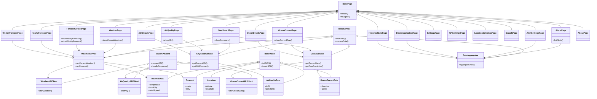

```mermaid
classDiagram
    %% Base Classes
    class BasePage {
        +render()
        +navigate()
    }

    class BaseService {
        +fetchData()
        +processData()
    }

    class BaseAPIClient {
        +requestAPI()
        +handleResponse()
    }

    class BaseModel {
        +toJSON()
        +fromJSON()
    }

    %% Pages
    class DashboardPage {
        +showSummary()
    }
    
    class WeatherPage {
        +showCurrentWeather()
    }
    
    class ForecastDetailsPage {
        +showHourlyForecast()
        +showWeeklyForecast()
    }
    
    class HourlyForecastPage
    class WeeklyForecastPage
    
    class AirQualityPage {
        +showAQI()
    }
    
    class AQIDetailsPage
    
    class OceanCurrentPage {
        +showCurrentFlow()
    }
    
    class OceanDetailsPage
    class AlertsPage {
        +listAlerts()
    }
    
    class AlertSettingsPage
    class SettingsPage
    class APISettingsPage
    class LocationSelectionPage
    class SearchPage
    class DataVisualizationPage
    class HistoricalDataPage
    class AboutPage

    %% Services
    class WeatherService {
        +getCurrentWeather()
        +getForecast()
    }
    
    class AirQualityService {
        +getCurrentAQI()
        +getAQIForecast()
    }
    
    class OceanService {
        +getCurrentData()
        +getFlowPrediction()
    }
    
    class DataAggregator {
        +aggregateData()
    }

    %% API Clients
    class WeatherAPIClient {
        +fetchWeather()
    }
    
    class AirQualityAPIClient {
        +fetchAQI()
    }
    
    class OceanCurrentAPIClient {
        +fetchOceanData()
    }

    %% Models
    class WeatherData {
        +temperature
        +humidity
        +windSpeed
    }
    
    class Forecast {
        +hourly
        +daily
    }
    
    class AirQualityData {
        +AQI
        +pollutants
    }
    
    class OceanCurrentData {
        +direction
        +speed
    }
    
    class Location {
        +latitude
        +longitude
    }

    %% Inheritance Relationships
    BasePage <|-- DashboardPage
    BasePage <|-- WeatherPage
    BasePage <|-- ForecastDetailsPage
    BasePage <|-- HourlyForecastPage
    BasePage <|-- WeeklyForecastPage
    BasePage <|-- AirQualityPage
    BasePage <|-- AQIDetailsPage
    BasePage <|-- OceanCurrentPage
    BasePage <|-- OceanDetailsPage
    BasePage <|-- AlertsPage
    BasePage <|-- AlertSettingsPage
    BasePage <|-- SettingsPage
    BasePage <|-- APISettingsPage
    BasePage <|-- LocationSelectionPage
    BasePage <|-- SearchPage
    BasePage <|-- DataVisualizationPage
    BasePage <|-- HistoricalDataPage
    BasePage <|-- AboutPage

    BaseService <|-- WeatherService
    BaseService <|-- AirQualityService
    BaseService <|-- OceanService
    BaseService <|-- DataAggregator

    BaseAPIClient <|-- WeatherAPIClient
    BaseAPIClient <|-- AirQualityAPIClient
    BaseAPIClient <|-- OceanCurrentAPIClient

    BaseModel <|-- WeatherData
    BaseModel <|-- Forecast
    BaseModel <|-- AirQualityData
    BaseModel <|-- OceanCurrentData
    BaseModel <|-- Location

    %% Usage Relationships
    DashboardPage --> WeatherService
    DashboardPage --> AirQualityService
    DashboardPage --> OceanService

    WeatherPage --> WeatherService
    ForecastDetailsPage --> WeatherService
    HourlyForecastPage --> WeatherService
    WeeklyForecastPage --> WeatherService

    AirQualityPage --> AirQualityService
    AQIDetailsPage --> AirQualityService

    OceanCurrentPage --> OceanService
    OceanDetailsPage --> OceanService

    AlertsPage --> DataAggregator
    AlertSettingsPage --> DataAggregator

    DataVisualizationPage --> DataAggregator
    HistoricalDataPage --> DataAggregator

    WeatherService --> WeatherAPIClient
    AirQualityService --> AirQualityAPIClient
    OceanService --> OceanCurrentAPIClient

    WeatherService --> WeatherData
    WeatherService --> Forecast
    AirQualityService --> AirQualityData
    OceanService --> OceanCurrentData
```

