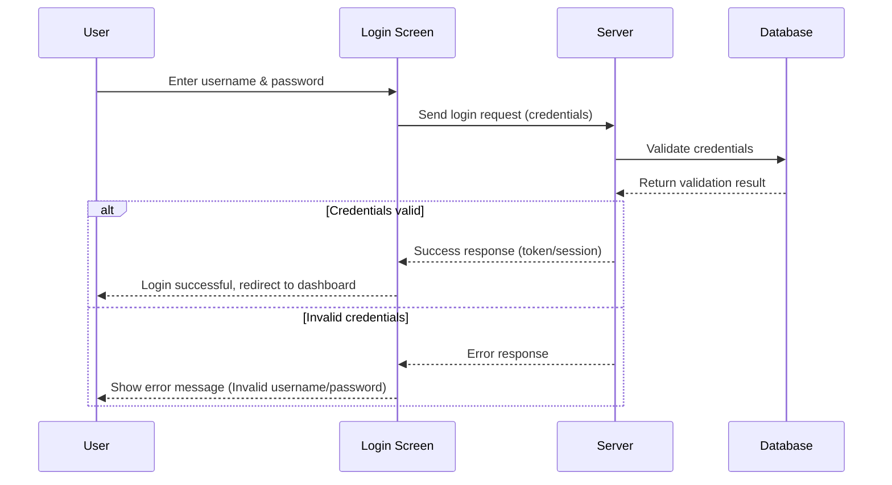

# Sequence Diagrams
For the proper flow purposes sequence diagrams are better than showing the actual algorithms as they provide a better visualisation of the flow of the data.

|Aspect|**Flowchart**|**Sequence Diagram**|
|---|---|---|
|**Purpose**|Shows the overall **workflow/logic** of a process.|Shows the **interaction between objects/actors over time**.|
|**Focus**|_What happens next?_ (control flow)|_Who talks to whom, and when?_ (message passing & timing)|
|**Best For**|Algorithms, decision-making, business processes.|Software design (UML), modeling communication between system parts.|
|**Representation**|Steps (rectangles), decisions (diamonds), flow arrows.|Lifelines (vertical dashed lines), messages (horizontal arrows).|
|**Time Aspect**|Usually **not explicit**; just logical order.|**Explicitly shows time** (top to bottom axis).|
|**Actors/Objects**|Not emphasized (just process flow).|Central — each lifeline represents an actor/object.|
|**Example Use Case**|Flowchart of login: input → check → output.|Sequence diagram of login: User → Server → Database interactions.|
|**Complexity Level**|Simple to medium, intuitive to non-technical users.|More technical, aimed at system architects/developers.|

---

# References

###### Information
- date: 2025.08.28
- time: 11:25