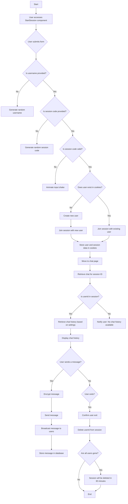

```mermaid
flowchart TD
    A[Start] --> B[User accesses StartSession component];
    B --> C{User submits form};
    C --> D{Is username provided?};
    D -- No --> E[Generate random username];
    D -- Yes --> F{Is session code provided?};
    F -- No --> G[Generate random session code];
    F -- Yes --> H{Is session code valid?};
    H -- No --> I[Animate input shake];
    H -- Yes --> J{Does user exist in cookies?};
    J -- Yes --> K[Join session with existing user];
    J -- No --> L[Create new user];
    L --> M[Join session with new user];
    M --> N[Store user and session data in cookies];
    K --> N;
    N --> P[Move to chat page];
    P --> Q[Retrieve chat for session ID];
    Q --> R{Is userId in session?};
    R -- Yes --> S[Retrieve chat history based on settings];
    R -- No --> T[Notify user: No chat history available];
    S --> U[Display chat history];
    U --> V{User sends a message?};
    V -- Yes --> W[Encrypt message];
    W --> X[Send message];
    X --> Y[Broadcast message to users];
    Y --> Z[Store message in database];
    V -- No --> AA{User exits?};
    AA -- Yes --> AB[Confirm user exit];
    AB --> AC[Delete userId from session];
    AC --> AD{Are all users gone?};
    AD -- Yes --> AE[Session will be deleted in 30 minutes];
    AD -- No --> O[End];
    AE --> O[End];

```
