Got it! Let's create UML sequence diagrams for each method, incorporating both API calls and socket interactions. The user will interact with the server via APIs for user creation and settings, while other operations will use sockets.

### 1. `initialize`

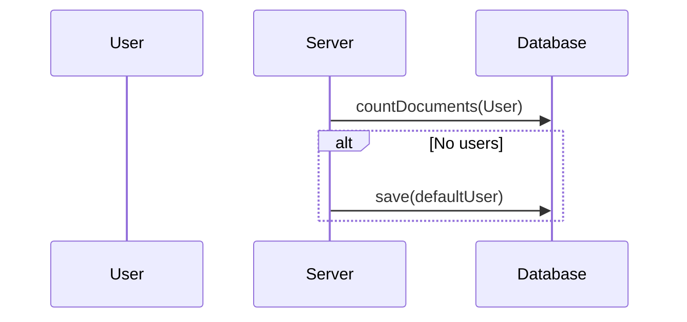

### 2. `newUser`

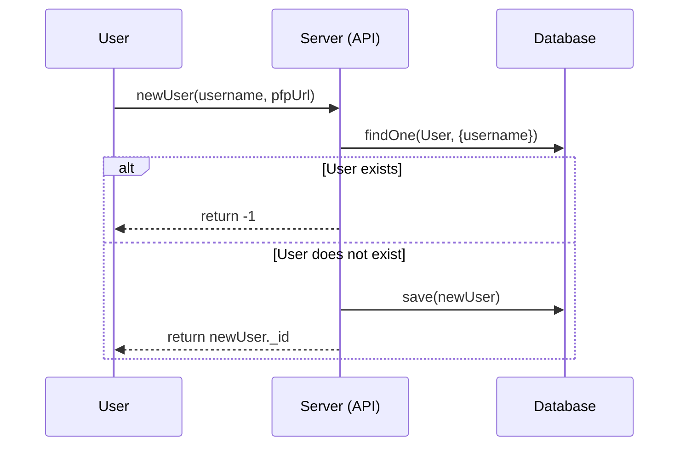

### 3. `createSession`

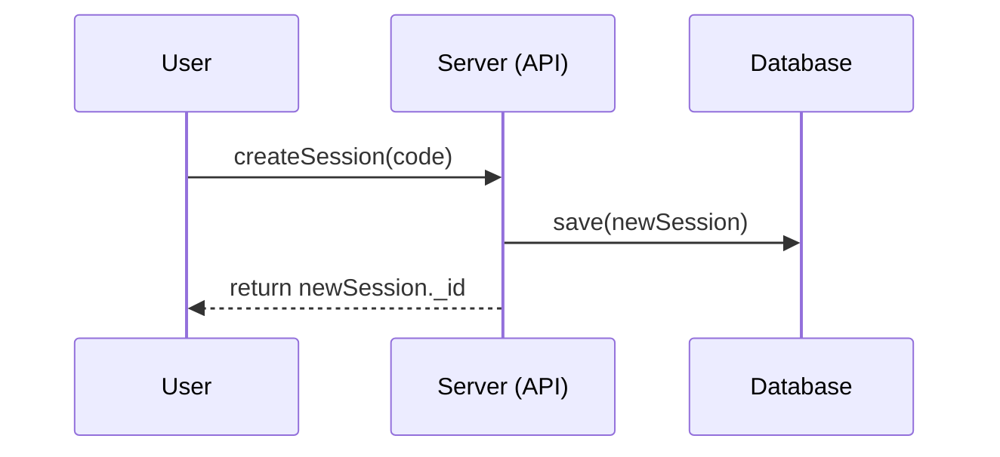

### 4. `joinSession`

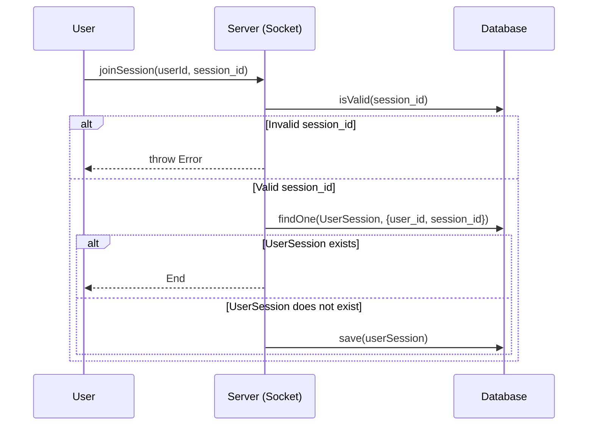

### 5. `addAdmin`

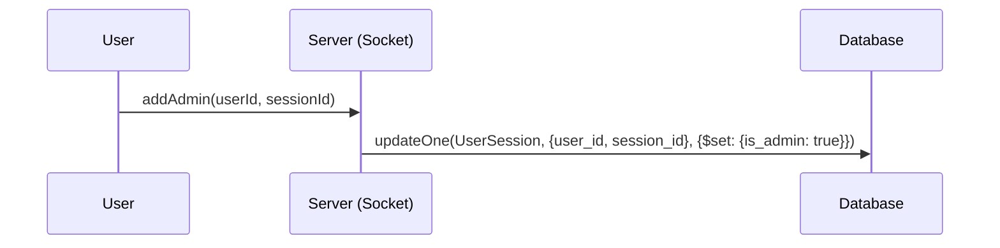

### 6. `removeAdmin`

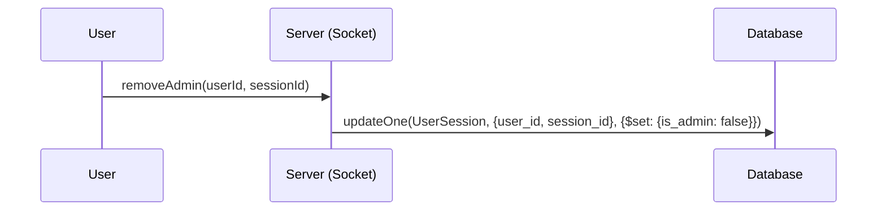

### 7. `joinOrCreateSession`

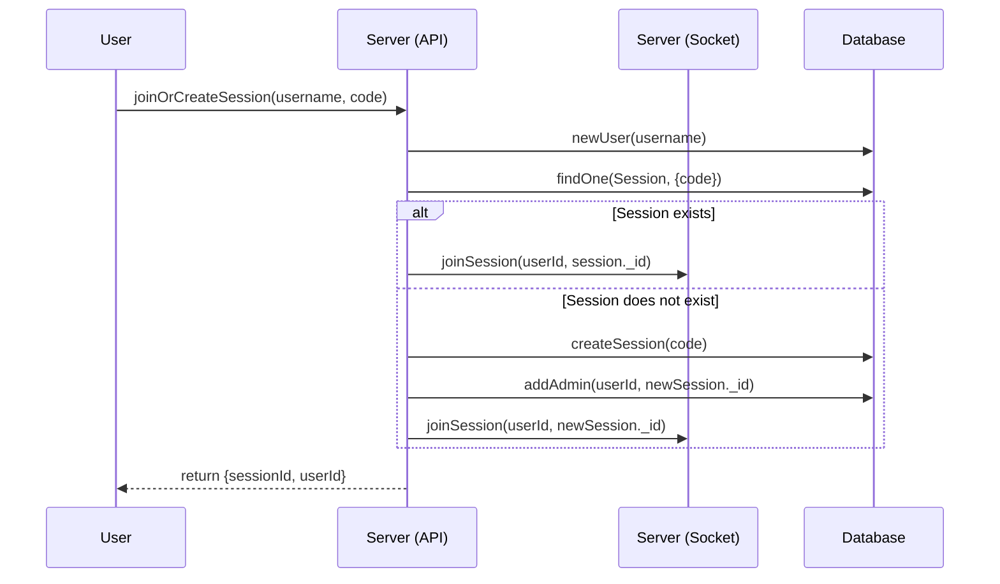

### 8. `sendMessage`

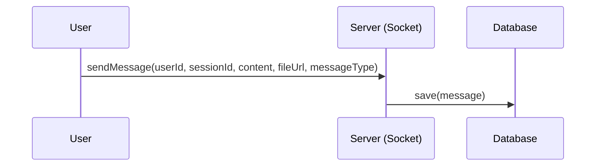

### 9. `getMessage`

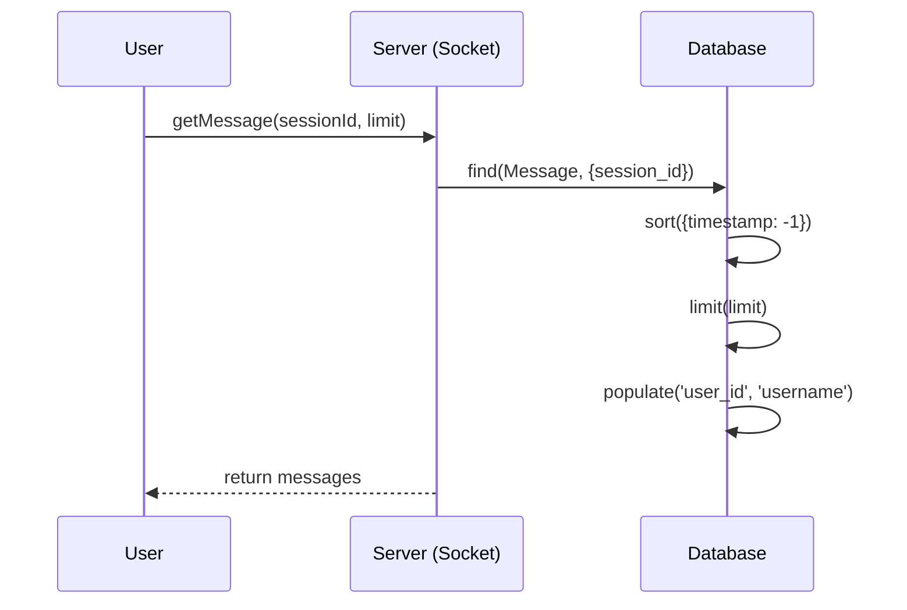

### 10. `updateSessionSettings`

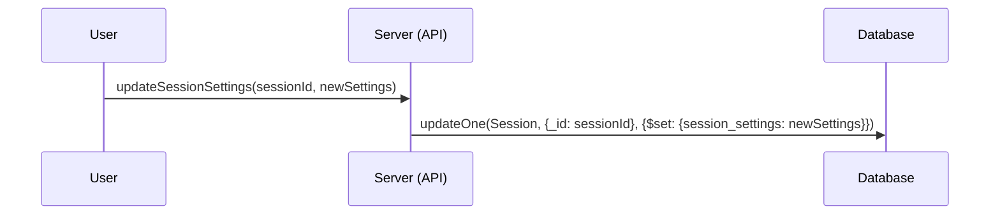

### 11. `editMessage`

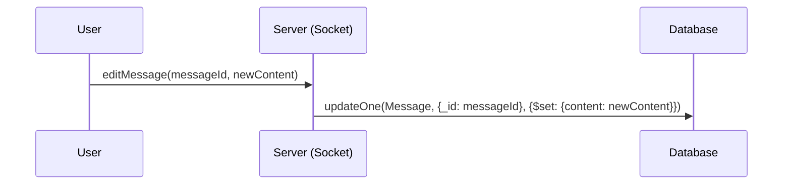

### 12. `deleteMessage`

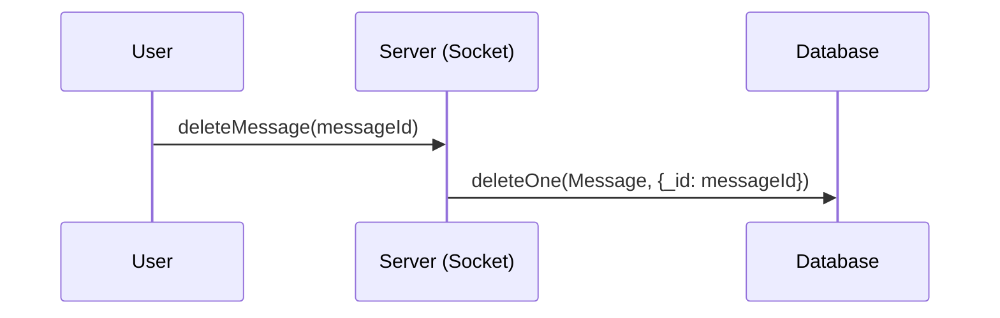

### 13. `checkMessage`

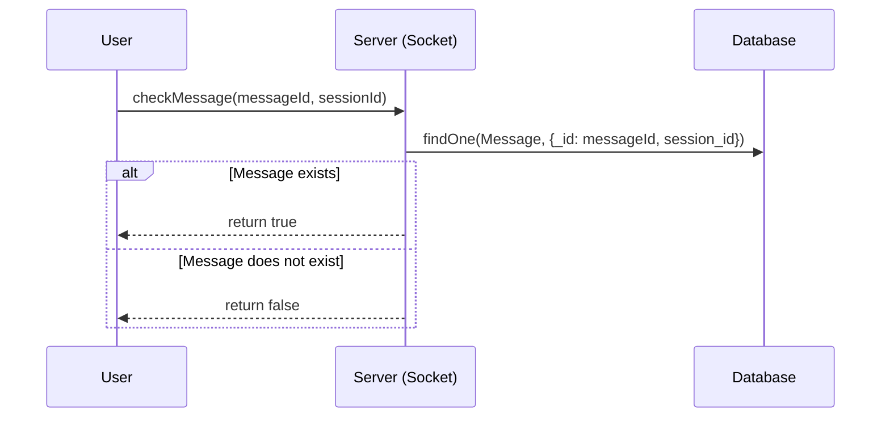

### 14. `checkSession`

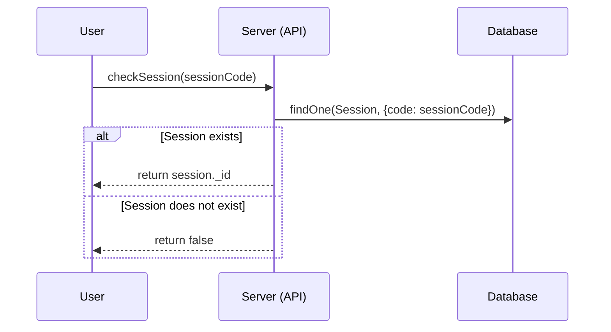

These UML sequence diagrams illustrate the interactions between the user, server (via API or sockets), and the database for each method, showing how different operations are handled using APIs and sockets.