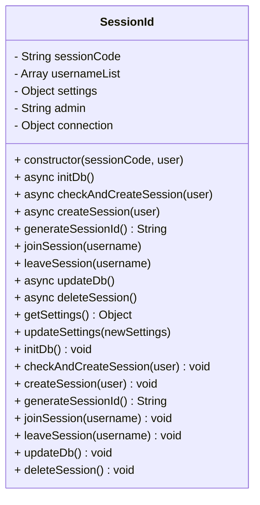
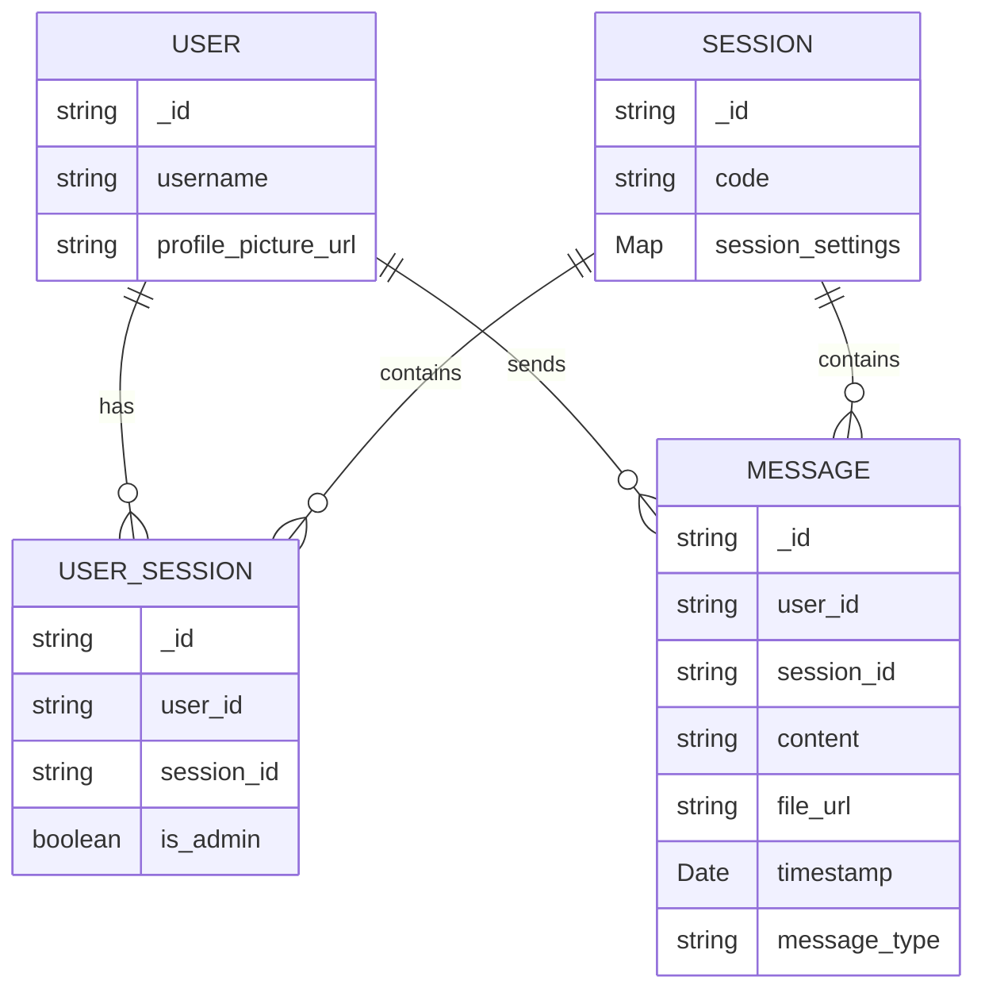
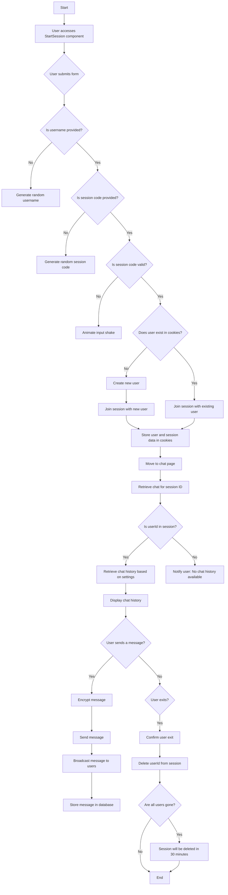

# SessionId Class Structure and Workflow

The `SessionId` class manages user sessions with database support using **MariaDB/MySQL** through the `mysql2/promise` library in Node.js. This class allows you to create, update, and delete sessions, manage user lists, and store session-specific settings in the database.

### Table of Contents
1. Overview
2. Constructor Properties and Methods
3. Database Operations
4. Class Diagram (Mermaid)
5. Usage and Execution Flow

---

## 1. Overview

The `SessionId` class is designed to handle user session information, including:
- **Session Code**: Unique identifier for each session.
- **Username List**: Stores users within the session.
- **Settings**: Configurable settings for each session.
- **Admin**: The primary user with control over the session settings.

The class ensures that session data is persistent in the database and can be modified by users (admin) or other instances of the session.

---

## 2. Constructor Properties and Methods

### Constructor
The constructor initializes essential properties and connects to the database:
- **sessionCode**: A unique code for identifying the session.
- **usernameList**: An array storing usernames of active participants.
- **settings**: Stores settings specific to each session (e.g., preferences).
- **admin**: The primary user of the session with admin rights.

```javascript
constructor(sessionCode, user) { ... }
```

### Key Properties
- **sessionCode**: Unique session code (passed during initialization).
- **usernameList**: List of usernames in the session.
- **settings**: Private settings object with session-specific configurations.
- **admin**: Initially set to `null`, updated when an admin is assigned.

### Main Methods
- **initDb()**: Connects to the database and checks for an existing session.
- **checkAndCreateSession()**: Checks if a session exists, else creates a new one.
- **createSession()**: Inserts a new session into the database.
- **joinSession(username)**: Adds a username to the session.
- **leaveSession(username)**: Removes a username from the session.
- **updateDb()**: Updates session details in the database.
- **deleteSession()**: Deletes the session from the database.

---

## 3. Database Operations

Each method handling session management involves querying the database to ensure data persistence:

### Database Methods:
1. **initDb()**:
   - Establishes a database connection using `mysql2/promise`.

2. **checkAndCreateSession(user)**:
   - Executes a `SELECT` query to check for an existing session.
   - Loads session data if found; else, calls `createSession()`.

3. **createSession(user)**:
   - Creates a unique session ID and inserts a new session record into the `sessions` table.

4. **updateDb()**:
   - Updates usernames, admin, and settings in the database for the current session.

5. **deleteSession()**:
   - Deletes the session row from the `sessions` table based on the `session_id`.

---

## 4. Class Diagram

Here's a visual overview of the `SessionId` class structure and its methods using **Mermaid** for easier visualization.



---

## 5. Usage and Execution Flow

### Usage Example
Here's an example of creating a new session and managing settings:

```javascript
const SessionId = require('./SessionId');
const session = new SessionId('12345ABC', 'adminUser');

// Add a new user to the session
session.joinSession('newUser');

// Update session settings
session.updateSettings({ theme: 'dark' });

// Delete session
session.deleteSession();
```

### Execution Flow

1. **Instance Creation**: `new SessionId('code', 'user')` initializes a session with a session code and user.
2. **Database Initialization**: `initDb()` is called to set up the database connection.
3. **Session Check**: `checkAndCreateSession(user)` verifies if a session exists or creates a new one.
4. **Session Modifications**: Methods like `joinSession(username)` and `leaveSession(username)` manage user lists, while `updateSettings(newSettings)` modifies session settings.
5. **Database Update**: `updateDb()` ensures all changes are saved.
6. **Session Deletion**: `deleteSession()` removes the session from the database, cleaning up data.

--- 

This documentation explains the structure, methods, and execution of the `SessionId` class and provides insight into each method's role in managing session data effectively.q






