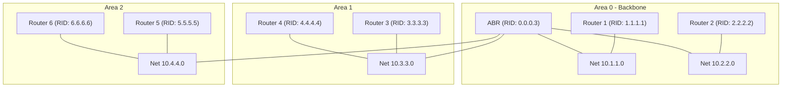
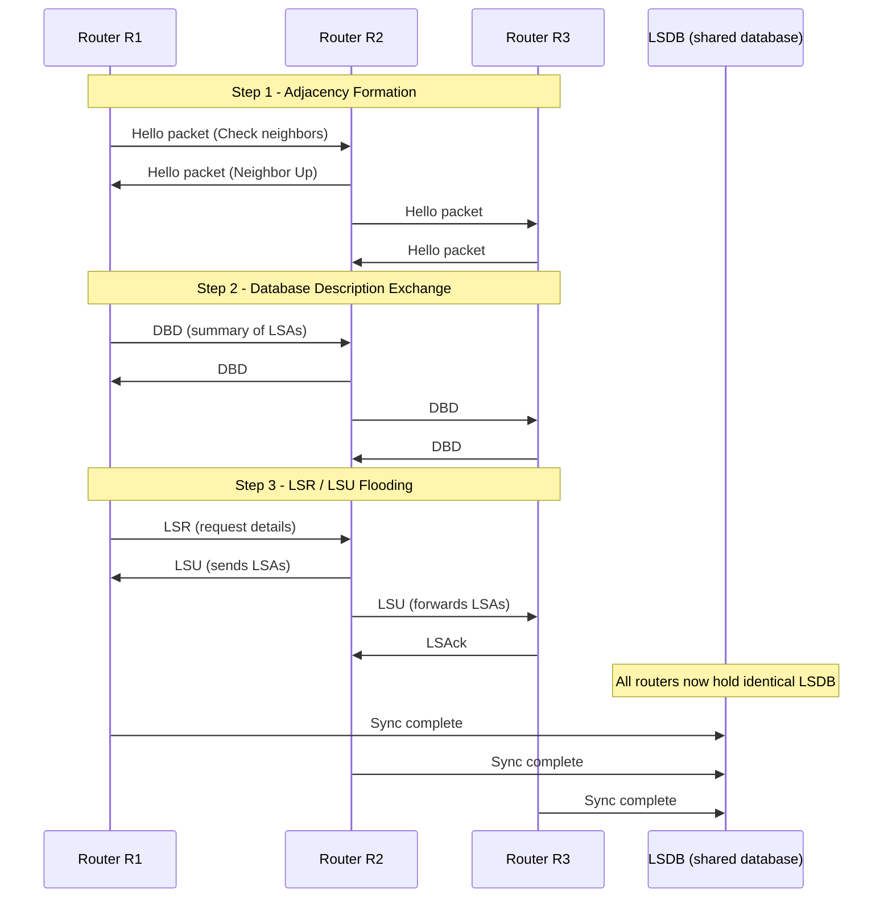
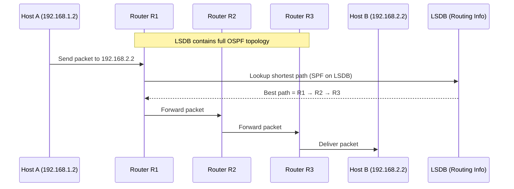

# OSPF
### OSPF (Open Shortest Path First)
* **Type:** Interior Gateway Protocol (IGP),[[ Link-State Routing Protocol]].
* **Standard:** Open protocol (not vendor-specific), defined by IETF.
* **Algorithm:** Uses [[Dijkstra’s Shortest Path First (SPF)]] algorithm to calculate best path.
* **Metric:** Cost, based on bandwidth (lower cost = better path).
* **Administrative Distance:** 110 (used when multiple protocols coexist).

---
### Key Features

1. **Hierarchical structure with Areas**
   * Reduces routing overhead and speeds up convergence.
   * Backbone area = Area 0 (all other areas must connect to it).

1. **Neighbor Relationships**
   * Routers exchange Hello packets to form adjacencies.
   * Only active neighbors exchange full link-state information.

1. **Link-State Database (LSDB)**
   * Each router builds a complete map of the network.
   * From LSDB, [[SPF algorithm]] is run to compute shortest paths.

1. **Fast Convergence**
   * Updates sent immediately when topology changes.
   * Uses LSAs (Link-State Advertisements) instead of full routing tables.

1. **Supports VLSM & CIDR**
   * Can handle variable subnet masks efficiently.

1. **Authentication Supported**
   * Plaintext or MD5 authentication between OSPF neighbors.

1. **Passive-Interface**
   * Stops sending OSPF Hellos on specific interfaces (e.g., LAN to PCs).

---

### OSPF Packet Types

1. **Hello** → Discover/maintain neighbors.
2. **DBD (Database Description)** → Summarizes LSDB contents.
3. **LSR (Link-State Request)** → Request specific LSAs.
4. **LSU (Link-State Update)** → Send LSAs.
5. **LSAck** → Acknowledges LSAs.

---

### OSPF vs RIP

* OSPF uses link-state (topology map) vs RIP’s distance-vector (hop count).
* OSPF scales better for large networks.
* Converges faster and uses cost metric (vs RIP’s max 15 hops).

In short: OSPF is a scalable, efficient, and fast-converging routing protocol that builds a full map of the network using link-state advertisements and Dijkstra’s SPF algorithm.


# Multi Area Configurations
Yes, OSPF can have multiple areas. Here’s how that works:
### OSPF Areas
* OSPF supports a **hierarchical design** by dividing a large network into **areas**.
* Each area has its own **Link-State Database (LSDB)**.
* Routers in one area only know the full topology of their own area, not of the entire network. This reduces memory and CPU usage.
### Rules about Areas
1. **Backbone Area (Area 0):**
   * All other areas must connect to Area 0.
   * It acts as the core for inter-area routing.

1. **Multiple Areas:**
   * Large networks can be split into areas like Area 0, Area 1, Area 2, etc.
   * Example: Area 1 could be a branch office, Area 2 another branch, both connect back to Area 0.

1. **Types of Routers in Multi-Area OSPF:**
   * **Internal Router:** All interfaces belong to the same area.
   * **Backbone Router:** Router that sits inside Area 0.
   * **Area Border Router (ABR):** Connects Area 0 to another area.
   * **Autonomous System Boundary Router (ASBR):** Connects OSPF to another routing protocol (like RIP or BGP).

---
### Why Multiple Areas?

* To improve **scalability**: large OSPF domains can overwhelm routers if they were a single area.
* To improve **efficiency**: LSAs are contained within their areas (not flooded across the whole network).
* To allow **administrative control**: separate areas can be managed independently.

---

Example:
* Area 0: HQ backbone
* Area 1: Branch office A
* Area 2: Branch office B
* ABRs connect Area 1 and Area 2 back to Area 0

---

# Case Studies

## Case Study : Lab Experiment

This is from [[Setting up OSPF & Telnetting Cybersecurity Fundamentals Lab 5 Task 1]] where i created a topology and the ospf database looks like this.
```bash

Router>enable
Router#show ip ospf database
            OSPF Router with ID (192.168.1.2) (Process ID 1)

                Router Link States (Area 0)

Link ID         ADV Router      Age         Seq#       Checksum Link count
192.168.1.2     192.168.1.2     898         0x80000004 0x0089bb 3
10.2.2.2        10.2.2.2        898         0x80000008 0x00ba3c 4
192.168.1.1     192.168.1.1     13          0x80000008 0x00f452 3
Router#
```

### Sample OSPF LSDB (based on earlier diagram)

```plaintext
Router# show ip ospf database

            OSPF Router with ID (1.1.1.1) (Process ID 1)

                Router Link States (Area 0)

Link ID         ADV Router      Age    Seq#       Checksum Link count
1.1.1.1         1.1.1.1         600    0x8000000A 0x00ABCD 2
2.2.2.2         2.2.2.2         600    0x8000000B 0x00BCDE 2
0.0.0.3         0.0.0.3         600    0x8000000C 0x00CDEF 3

                Net Link States (Area 0)

Link ID         ADV Router      Age    Seq#       Checksum
10.1.1.0        1.1.1.1         300    0x80000001 0x00A111
10.2.2.0        2.2.2.2         300    0x80000002 0x00A222

                Router Link States (Area 1)

Link ID         ADV Router      Age    Seq#       Checksum Link count
3.3.3.3         3.3.3.3         500    0x80000005 0x00D111 2
4.4.4.4         4.4.4.4         500    0x80000006 0x00D222 1
0.0.0.3         0.0.0.3         600    0x80000007 0x00D333 1

                Router Link States (Area 2)

Link ID         ADV Router      Age    Seq#       Checksum Link count
5.5.5.5         5.5.5.5         400    0x80000009 0x00E111 2
6.6.6.6         6.6.6.6         400    0x8000000A 0x00E222 1
0.0.0.3         0.0.0.3         600    0x8000000B 0x00E333 1
```

---
## Case Study : Customized Mermaid Diagram


### Explanation

- **Router Link States (Area X):** Each router in that area advertises itself and its connected links.
- **Net Link States:** Multi-access networks (Ethernet) or point-to-point subnets.
- **ABR (0.0.0.3):** Appears in multiple areas (Area 0, 1, 2) since it connects them. 

## Working
## Formation of the LSDB
- **Hello Packet**
	**Contains:**
	* Router ID
	* Area ID
	* Hello Interval
		* Defines how often a router sends Hello packets.
		  * Default: 10 seconds on broadcast and point-to-point links, 30 seconds on NBMA.
		  * If mismatched between routers → they won’t become neighbors.
	* **Dead Interval**
		* Timer for how long a router will wait before declaring a neighbor down if no Hellos are received.
		* Usually 4 × Hello interval (default 40 sec on broadcast/P2P).
		* Critical: If mismatched between routers, adjacency will fail.
		* Neighbors list
	* Network mask
	* Options (capabilities, like whether router supports certain LSAs)
	* DR/BDR priority
		* Designated Router
		* Backup Designated Router

- **DBD Packet ( Database Description Packet )**
	**Contains:**	
	* Router ID
	* Sequence number (ordering)
	* List of LSA headers (summaries only)
	**Detailed Notes:**
	* Used only at the start of adjacency.
	* Lets routers compare “who has what” without sending the entire LSDB at once.

- **LSR (Link State Request)**
	**Contains:**
	* Router ID
	* Requested LSA type and ID
	**Detailed Notes:**
	* Think of it as a shopping list: “Please send me details of these LSAs you mentioned.”

- **LSU (Link State Update)**
	**Contains:**
	* One or more full LSAs
	**Detailed Notes:**
	* Carries the real data (topology info).
	* Flooded across the area until all routers receive it.
	* Types of LSAs include:
  * **Type 1 (Router LSA):** Describes router links.
  * **Type 2 (Network LSA):** Describes broadcast/multi-access network.
  * **Type 3/4 (Summary LSAs):** Advertise networks between areas.
  * **Type 5 (External LSAs):** External routes (e.g., from RIP, BGP).

-  **LSAck (Link State Acknowledgement)**
	**Contains:**
	* Router ID
	* List of LSAs being acknowledged
	**Detailed Notes:**
	* Ensures reliability → OSPF doesn’t assume delivery; it wants proof.
	* Works like TCP ACK, but inside OSPF’s reliable flooding system.
- **LSDB (Link-State Database)**
	**Contains:**
	* Collection of all LSAs known to the router
	* One LSDB per **area**
	* Synchronized between routers in that area
	**Detailed Notes:**
	* Identical in all routers in the same area.
	* Input for **SPF (Dijkstra’s algorithm)** → builds shortest-path tree.
	* SPF result = routing table entries.

---



---

### Working Using the LSDB 

# References


###### Information
- date: 2025.09.05
- time: 10:26